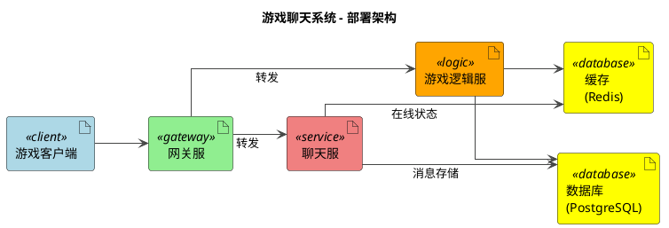

```plantuml {kroki=true}
@startuml 游戏系统部署架构
!theme vibrant
skinparam linetype ortho

title 游戏聊天系统 - 部署架构

left to right direction

' 定义样式
skinparam node {
    BackgroundColor White
    BorderColor Black
    FontSize 12
}

skinparam artifact {
    BackgroundColor<<client>> LightBlue
    BackgroundColor<<gateway>> LightGreen
    BackgroundColor<<service>> LightCoral
    BackgroundColor<<logic>> Orange
    BackgroundColor<<database>> Yellow
}

' 客户端节点

artifact "游戏客户端" as client_app <<client>>


' 应用服务器组件
artifact "网关服" as gateway <<gateway>>
artifact "聊天服" as chat <<service>>
artifact "游戏逻辑服" as logic <<logic>>

' 强制垂直排序
gateway -[hidden]down-> chat
chat -[hidden]down-> logic

' 数据中心组件
artifact "数据库\n(PostgreSQL)" as postgres <<database>>
artifact "缓存\n(Redis)" as redis <<database>>

' 网络连接
client_app --> gateway 
' 网关分发
gateway --> logic : 转发
gateway --> chat : 转发

' 业务连接
chat --> postgres : 消息存储
chat --> redis : 在线状态

logic --> postgres 
logic --> redis

@enduml
```