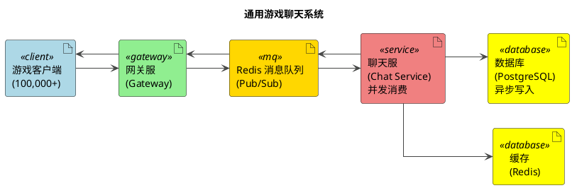

## 架构说明

1. **消息队列解耦**: Gateway 和 Chat Service 之间完全通过 Redis Pub/Sub 通信，消除了直连带来的连接池瓶颈。

2. **并发消费模型**: Chat Service 为每个接收到的消息启动独立的 Goroutine 处理，充分利用多核 CPU。

3. **异步持久化**: 数据库写入通过 Buffered Channel + Worker Pool 实现，用户请求不再等待磁盘 I/O。

4. **可扩展性**:
   - **Gateway**: 无状态，可水平扩展（所有实例订阅同一个 `broadcast` 频道）
   - **Chat Service**: 可部署多实例消费同一队列（建议升级为 Redis Streams 或 Kafka 以避免消息重复）
   - **消息队列**: 当前使用 Redis，已抽象接口（`mq.Producer/Consumer`），可无缝切换至 Kafka/RabbitMQ

### 性能指标

- **并发连接**: 100,000+ WebSocket 长连接
- **成功率**: 100%
- **平均延迟**: 2.2ms
- **最大延迟**: 88.89ms
- **吞吐量**: 830+ req/s

详见：[压力测试报告](STRESS_TEST_100000_USERS_REPORT.md)