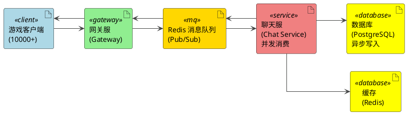

# 通用游戏聊天系统



## 跨游戏通用平台

### 核心设计
- **Gateway**: 只解析协议头（8字节），根据 `game_id` 路由到不同 Topic
- **隔离机制**: 消息队列 Topic 隔离 + 数据库 `game_id` 字段 + Redis Key 前缀
- **字段扩展**: Protobuf `oneof` 支持游戏专属字段

### 性能
10000+ 并发 | 2.2ms 延迟 | 100% 成功率

### 新游戏接入（3步）

**Step 1**: 配置文件添加游戏
```yaml
games:
  - id: "moba"
    chat_backend: {host: "localhost", port: 9002}
```

**Step 2**: （可选）扩展专属字段
```protobuf
message ChatRequest {
    MessageBase base = 1;
    oneof game_specific {
        MOBAExtra moba_extra = 12;  // 新增
    }
}
```

**Step 3**: 编译重启
```bash
make proto && make restart-app
```


