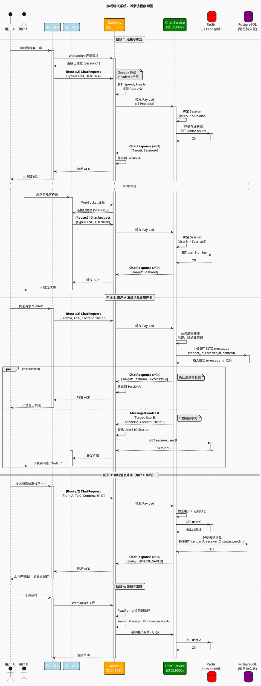

```plantuml {kroki=true}
@startuml Chat System Sequence Diagram
!theme mars
skinparam sequenceMessageAlign center
skinparam responseMessageBelowArrow true

title 游戏聊天系统 - 消息流程序列图

actor "用户 A" as UserA
actor "用户 B" as UserB
participant "客户端 A" as ClientA #LightBlue
participant "客户端 B" as ClientB #LightBlue
participant "Gateway\n(端口:8080)" as Gateway #Orange
participant "Chat Service\n(端口:9002)" as ChatService #Green
database "Redis\n(Session存储)" as Redis #Red
database "PostgreSQL\n(消息持久化)" as DB #Purple

== 阶段 1: 连接与绑定 ==

UserA -> ClientA: 启动游戏客户端
activate ClientA
ClientA -> Gateway: WebSocket 连接请求
activate Gateway
Gateway --> ClientA: 连接已建立 (Session_1)
ClientA -> Gateway: **[Route:2] ChatRequest**\n(Type=BIND, UserID=A)
note right: Speedy 协议\nHeader: 4字节
Gateway -> Gateway: 解析 Speedy Header\n提取 Route=2
Gateway -> ChatService: 转发 Payload\n(纯 Protobuf)
activate ChatService

ChatService -> ChatService: 绑定 Session\n(UserA -> SessionA)
ChatService -> Redis: 存储在线状态\nSET user:A online
activate Redis
Redis --> ChatService: OK
deactivate Redis

ChatService --> Gateway: **ChatResponse** (ACK)\n[Target: SessionA]
Gateway -> Gateway: 路由到 SessionA
Gateway --> ClientA: 转发 ACK
ClientA --> UserA: ✅ 绑定成功
deactivate ClientA

...同样的流程...

UserB -> ClientB: 启动游戏客户端
activate ClientB
ClientB -> Gateway: WebSocket 连接
Gateway --> ClientB: 连接已建立 (Session_2)
ClientB -> Gateway: **[Route:2] ChatRequest**\n(Type=BIND, UserID=B)
Gateway -> ChatService: 转发 Payload
ChatService -> ChatService: 绑定 Session\n(UserB -> SessionB)
ChatService -> Redis: SET user:B online
Redis --> ChatService: OK
ChatService --> Gateway: **ChatResponse** (ACK)\n[Target: SessionB]
Gateway --> ClientB: 转发 ACK
ClientB --> UserB: ✅ 绑定成功
deactivate ClientB

== 阶段 2: 用户 A 发送消息给用户 B ==

UserA -> ClientA: 发送消息 "Hello!"
activate ClientA
ClientA -> Gateway: **[Route:2] ChatRequest**\n(From:A, To:B, Content:"Hello!")
Gateway -> ChatService: 转发 Payload

ChatService -> ChatService: 业务逻辑处理\n验证、过滤敏感词
ChatService -> DB: INSERT INTO messages\n(sender_id, receiver_id, content)
activate DB
DB --> ChatService: 插入成功 (message_id:123)
deactivate DB

par 并行响应处理
    ChatService --> Gateway: **ChatResponse** (ACK)\n[Target: SessionA, Success:true]
    note right: 确认消息已收到
    Gateway -> Gateway: 路由到 SessionA
    Gateway --> ClientA: 转发 ACK
    ClientA --> UserA: ✅ 消息已发送
    deactivate ClientA
else
    ChatService --> Gateway: **MessageBroadcast**\n[Target: UserB,\nSender:A, Content:"Hello!"]
    note right: 广播给接收方
    Gateway -> Gateway: 查找 UserB 的 Session
    Gateway -> Redis: GET session:user:B
    activate Redis
    Redis --> Gateway: SessionB
    deactivate Redis
    
    activate ClientB
    Gateway --> ClientB: 转发广播
    ClientB --> UserB: 💬 收到消息: "Hello!"
    deactivate ClientB
end

== 阶段 3: 离线消息处理（用户 C 离线） ==

UserA -> ClientA: 发送消息给离线用户 C
activate ClientA
ClientA -> Gateway: **[Route:2] ChatRequest**\n(From:A, To:C, Content:"Hi C")
Gateway -> ChatService: 转发 Payload

ChatService -> ChatService: 检查用户 C 在线状态
ChatService -> Redis: GET user:C
activate Redis
Redis --> ChatService: NULL (离线)
deactivate Redis

ChatService -> DB: 保存离线消息\nINSERT (sender:A, receiver:C, status:pending)
DB --> ChatService: OK
ChatService --> Gateway: **ChatResponse** (ACK)\n[Status: OFFLINE_SAVED]
Gateway --> ClientA: 转发 ACK
ClientA --> UserA: ⚠️ 用户离线，消息已保存
deactivate ClientA

== 阶段 4: 断线与清理 ==

UserA -> ClientA: 退出游戏
activate ClientA
ClientA -> Gateway: WebSocket 关闭
Gateway -> Gateway: ReadPump 检测到断开
Gateway -> Gateway: SessionManager.Remove(SessionA)
Gateway -> ChatService: 通知用户离线 (可选)
ChatService -> Redis: DEL user:A
activate Redis
Redis --> ChatService: OK
deactivate Redis
Gateway --> ClientA: 连接关闭
deactivate ChatService
deactivate Gateway
deactivate ClientA

@enduml
```