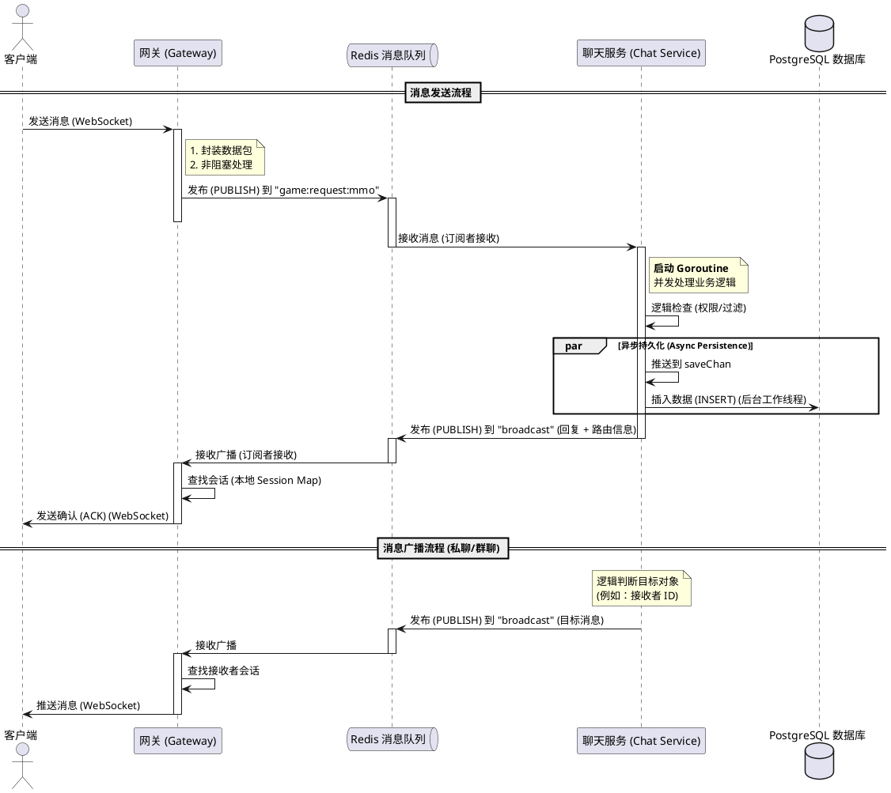

# 时序图 (异步流程)

该图展示了 v2.0 架构中聊天消息的逻辑流转过程。

## 设计说明

1. **解耦与非阻塞**: 架构的核心在于消除了 Gateway 到 Chat Service 的直接同步调用。
   - 之前版本需要从连接池中 `Get()` 连接，在高并发下容易产生阻塞。
   - 当前版本通过消息队列发布请求，Gateway 可以在发布后立即处理下一个连接。
2. **消息队列抽象**: 虽然当前实现使用的是 Redis Pub/Sub，但系统代码已经对消息队列接口进行了通用抽象（`mq.Producer` 和 `mq.Consumer`）。
   - 这种设计允许我们在不修改核心业务逻辑的情况下，根据实际性能需求，轻松地将 Redis 替换为 **Kafka**、**RabbitMQ** 或其他专业级消息中间件。
3. **性能优势**: 这种异步模式极大地提高了系统的吞吐量，将单机平均延迟从秒级降低到了毫秒级（~2.2ms）。